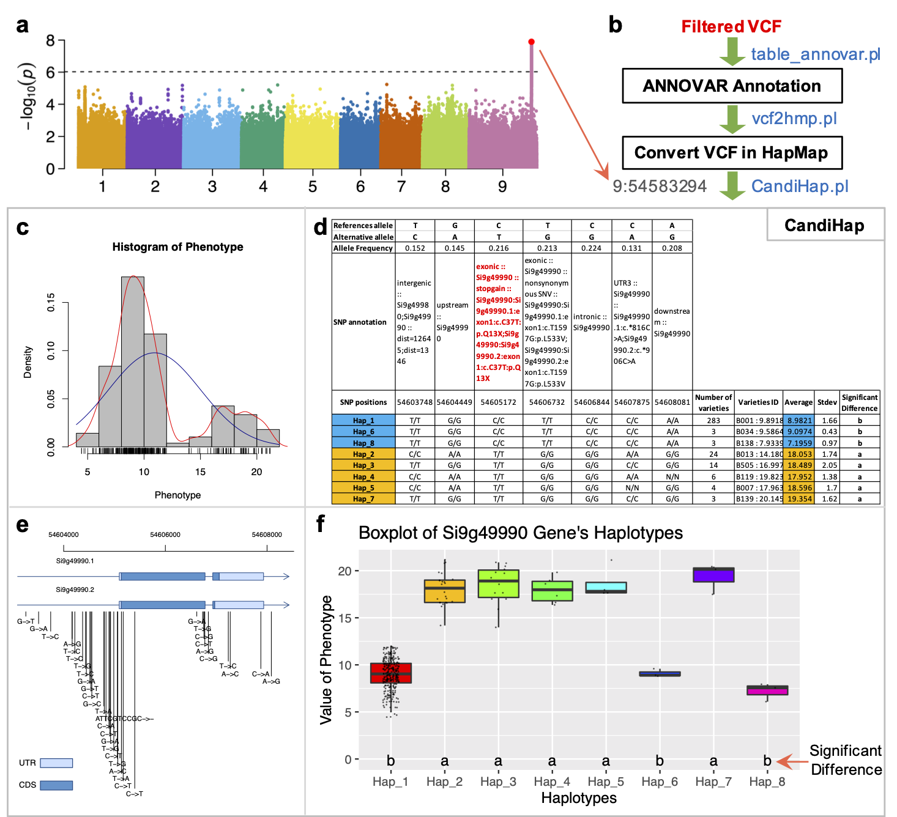
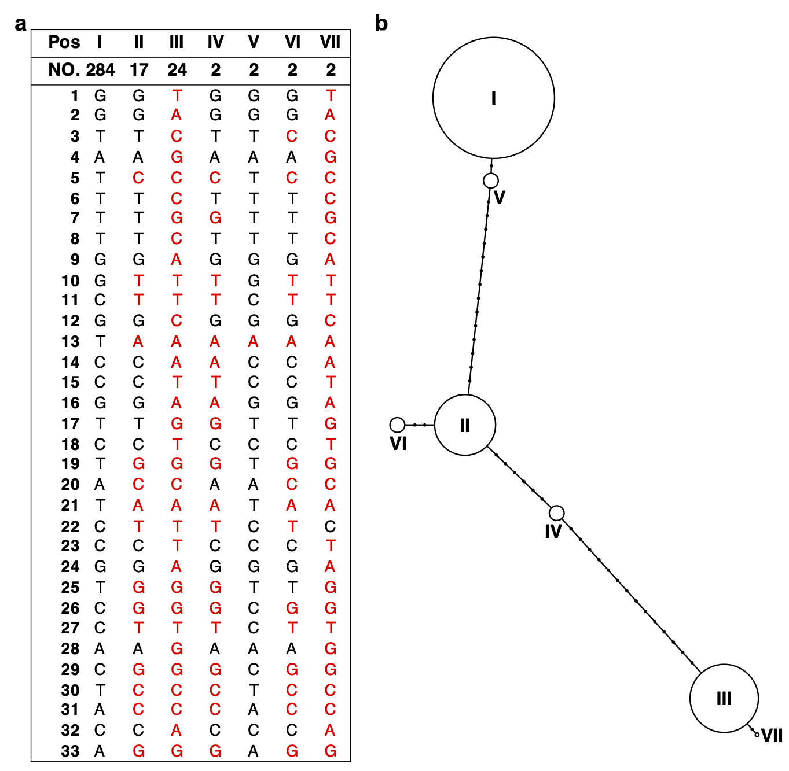
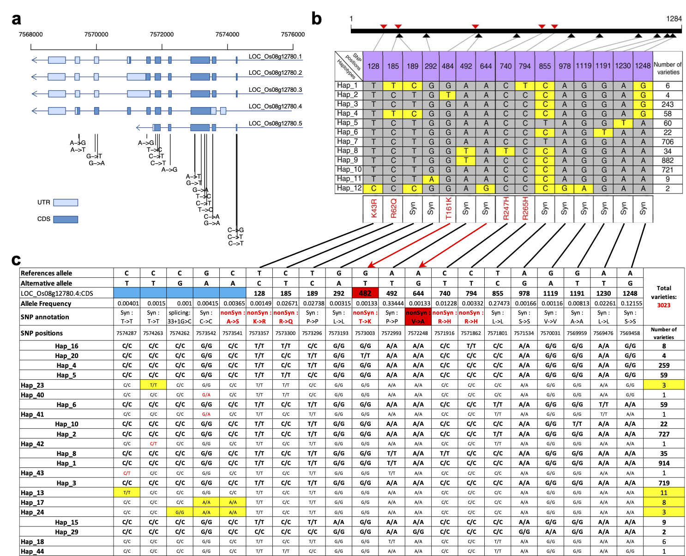

 

# CandiHap: a haplotype analysis toolkit for natural variation study
Natural variation analysis is widely used to identify genes related to complex traits in plants, animals and human. Generally, the identified SNP is not necessarily the causal variant, but it is rather in linkage disequilibrium (LD). One key challenge for the interpretation of Genome-wide association study (GWAS) results is to rapidly identify causal genes and provides profound evidence to what extent they affect the trait. It is required to identify candidate causal variants from the most significant SNPs of GWAS in any species, usually on local PCs, which is laborious, time-consumingand prone to errors and omission. To our knowledge, so far there is no tool available to solve the challenge for fast and reliable analysi of GWAS data. Based on the standard variant call format (VCF), __`CandiHap`__ is developed for fast preselection of candidate causal SNPs and gene(s) from GWAS by integrating the LD results, SNP annotation, haplotype analysis and traits statistics of the haplotypes. Investigators can specify genes or linkage regions based on GWAS results, linkage disequilibrium (LD), and predicted candidate causal gene(s). The system could be run on computers with Windows, Mac and UNIX platforms in graphical user interface (GUI) and command lines, and applied to any specis of plant, animal and bacterium. The preprint has posted on bioRxiv: https://biorxiv.org/cgi/content/short/2020.02.27.967539v1 </br>

## License
Academic users may download and use the application free of charge according to the accompanying license. Commercial users must obtain a commercial license from Xukai Li. If you have used the program to obtain results, please cite the following paper:</br>

> Xukai Li☯* (李旭凯), Zhiyong Shi☯ (石志勇), Qianru Qie (郄倩茹), Jianhua Gao (高建华), Xingchun Wang (王兴春) & Yuanhuai Han (韩渊怀). CandiHap: a toolkit for haplotype analysis for sequence of samples and fast identification of candidate causal gene(s) in genome-wide association study. bioRxiv 2020.02.27.967539. doi: https://doi.org/10.1101/2020.02.27.967539</br>
> （☯ Equal contributors; * Correspondence）</br>
</br>

## Dependencies
__`perl 5`__, __`R ≥ 3.2`__ (with ggplot2, agricolae and pegas), __`Python 2.7`__, and __`electron`__. </br></br>

## Getting started
There are mainly three steps included in the CandiHap analytical through command lines, and the test data files can freely download at test_data.</br>
Put __`vcf2hmp.pl`__  test.gff, test.vcf, and genome.fa files in a same dir, then run annovar (table_annovar.pl):</br>
```
     gffread  test.gff   -T -o test.gtf
     gtfToGenePred -genePredExt test.gtf  si_refGene.txt
     retrieve_seq_from_fasta.pl --format refGene --seqfile  genome.fa  si_refGene.txt --outfile si_refGeneMrna.fa
     
     table_annovar.pl  test.vcf  ./  --vcfinput --outfile  test --buildver  si --protocol refGene --operation g -remove
     
     # 0.1 means the minor allele frequency (MAF)
     perl  vcf2hmp.pl  test.vcf  test.si_multianno.txt  0.1
```
</br>

Put __`CandiHap.pl`__ and Phenotype.txt files in a same dir, then run:</br>
```
     perl  CandiHap.pl  ./Your.hmp  ./Phenotype.txt  ./genome.gff  Your_gene_ID
e.g. perl  CandiHap.pl  ./haplotypes.hmp   ./Phenotype.txt  ./test.gff  Si9g49990
```
</br>

By the way, if you want do All gene in LD region of a position, then run:</br>
```
     perl  GWAS_LD2haplotypes.pl   ./genome.gff  ./ann.hmp  ./Phenotype.txt  50kb  Chr:position
e.g. perl  GWAS_LD2haplotypes.pl   ./test.gff  ./haplotypes.hmp   ./Phenotype.txt   50kb  9:54583294
```
</br>


Fig. 1 | Overview of the CandiHap process. a, A GWAS result. b, General scheme of the process. c, The histogram of phenotype. d, The statistics of haplotypes and significant differences haplotypes are highlighted by color boxes. e, Gene structure and SNPs of a critical gene. f, Boxplot of a critical gene’s haplotypes. </br>


Fig. 2 | Haplotype network analysis for Si9g49990. (a) The difference of haplotypes. (b) Haplotype network. Note: only the SNPs and haplotypes found in ≥2 accessions were used to construct the haplotype network. The value of circle size had converted into log2. </br>


Fig. 3 | Haplotype analysis of the ARE1 gene in rice compared with the results by Wang et al. 2018, Nat. Commun. 9, 735. a, Gene structure and SNPs of ARE1. b, Major haplotypes of SNPs in the ARE1 coding region of 2747 rice varieties (https://www.nature.com/articles/s41467-017-02781-w/figures/5). c, The haplotype results of ARE1 coding region of 3023 rice varieties using CandiHap (SNPs data were downloaded from RFGB, http://www.rmbreeding.cn). Major SNP haplotypes and casual variations in the encoded amino acid residues are shown. The five more SNPs is due to the fact that there are 276 more rice varieties used in our study (highlighted by blue boxes), and two errors highlighted by red boxes. </br></br>

## Contact information
In the future, CandiHap will be regularly updated, and extended to fulfill more functions with more user-friendly options.</br>
For any questions please contact xukai_li@sxau.edu.cn or xukai_li@qq.com </br>
