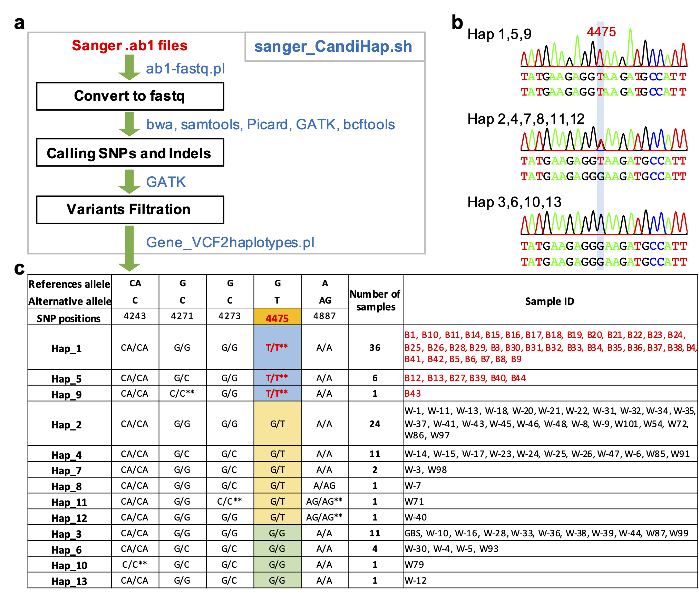

# CandiHap: haplotype analysis in Sanger ab1 files

Need GATK (GenomeAnalysisTK.jar), Picard (picard.jar), bwa, samtools, bcftools, bgzip, java, perl and R (with sangerseqR)</br></br>

## Dependencies
install __`sangerseqR`__ packages in R:</br>
```
if (! requireNamespace("BiocManager", quietly = TRUE)) install.packages("BiocManager")
if (! require("sangerseqR")) BiocManager::install("sangerseqR")
```

## Getting started
Put __`sanger_CandiHap.sh`__, __`Gene_VCF2haplotypes.pl`__, __`ab1-fastq.pl`__ and all __`sanger_teat_data`__ files in a same dir, then run:</br>
```
     sh  sanger_CandiHap.sh  Gene_ref.fa
e.g. sh  sanger_CandiHap.sh  PHYC.txt
```



Fig. 1 | Overview of the sanger_CandiHap process. a, General scheme of the process from Sanger ab1 files. b, PeakTrace of ab1 images of three main genotypes. c, The statistics of haplotypes. </br>
